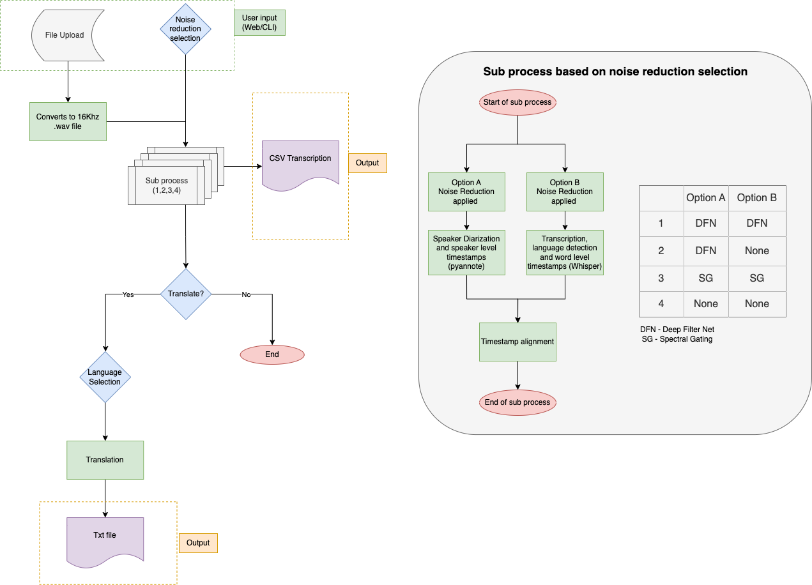

# Noisy Speech to Text

Webapp user interface (UI) as well as a command line interface (CLI) for a noisy speech-to-text (nSTT) solution. The solution takes an audio file in a range of formats (.wav, .mp3, .ogg, .mp4, .flv, .wma, .m4a or .aac) and prompts a noise resuction technique selection by the user. These noise reduction selections are then applied to both the Whisper model and speaker diarization inputs (see architecture below). The output of this solution is a .csv file that displays the audio by speaker with time stamps. The user then has an option to translate this to a chosen language.
On the command line interface, you have the option to save more files with extra data, such as just the text in a .txt file, the word level timestamps in a .json file, and the translated text in a .txt file. Further to this, both the webapp and the CLI can be run either locally, or on a virtual machine (VM). This allows for us to run bigger and better AI models in short timescales. 

#### Benefits and features of solution:
- Ultilising different transciber models (Whisper) that can be run both on a (VM) and locally.
- CLI option, which makes it easy to automate lots of files and to integrate it into other systems.
- Mutiple input audio file formats accepted including .mp3, .wav;
- Support multiple (99) languages;
- Output the transcription into a .csv file that can be shared;
- Ability to translate transciptions (needs further development)
- Easy nagivation to sections of audio file using time stamping
- Speaker diarization (needs further development for accuracy)
- Based on open source solutions and tooling

## Architecture
Pipeline

## Requirements and Installation
pip install the requirements txt file. The system also needs to have ffmpeg downloaded. On Windows you may need to modify the PATH variables. We also require Python version >= 3.10.
Add further requirements, especially for a VM.

## Overview

### Converting file type
For the rest of the process the .wav file format is required. To allow the user to upload any file format a conversion process is needed. This was also important to implement as the sample rate needs to be 16KHz for the functions later on to work. A simple conversion process happens as the first step after the user uploads their file.

### Noise Reduction Techniques
Noise reduction of audio is a widely explored area of research as having clean, understandable audio is crucial for so many applications. A good amount of time on day 1 was dedicated to researching what algorithms are already out there and what noise different ones work best on.

#### DeepFilterNet
[DeepFilterNet](https://github.com/Rikorose/DeepFilterNet), or DFN, is an AI noise reduction model. It is a tool that can be adapted for audio processing tasks, such as reducing noise in audio signals. The process begins with preprocessing the input audio, which involves segmenting the audio into manageable chunks and converting it into a suitable format for neural network input. DeepFilterNet then employs convolutional neural networks (CNNs) to extract relevant features, learning to distinguish between noise and signal components. The neural network layers process these features, leveraging their hierarchical representations to map noisy spectrograms to their clean counterparts. During training, the model learns to minimise the discrepancy between the predicted clean spectrograms and the ground truth clean spectrograms, typically using a loss function such as mean squared error. Through back propagation and optimisation algorithms like gradient descent, the model's parameters are adjusted to improve its ability to denoise audio signals.

#### noisereduce Spectral Gating
Another noise reduction techniqure we used was spectral gating via [noisereduce](https://github.com/timsainb/noisereduce). This process begins by analysing the spectral characteristics of the input audio signal, typically represented as a time-frequency spectrogram. Spectral gating involves identifying segments of the spectrogram that primarily contain noise components rather than the desired signal. This is accomplished by setting a threshold based on the amplitude or energy of the spectrogram bins. Segments of the spectrogram that fall below the threshold are considered to be dominated by noise and are subsequently attenuated or removed from the signal. The remaining segments, which contain the desired signal, are retained or boosted to enhance their prominence in the output. The spectral gating tool chosen was noisereduce 3.0.0.

### Whisper
[Whisper](https://github.com/openai/whisper) is a cutting-edge technology designed to create accurate transcripts of audio clips, particularly focusing on speech content. Through this link you can download the models we used (base.pt, medium.pt, and large-v3.pt). It employs advanced speech recognition algorithms and natural language processing (NLP) techniques to convert spoken words into written text. The process begins by segmenting the audio clip into smaller units, such as sentences or phrases, to make the processing more efficient. Whisper then applies automatic speech recognition (ASR) to transcribe each segment. This involves analysing the acoustic features of the audio, such as spectrograms and waveform patterns, to recognise phonemes, words, and sentences. Additionally, Whisper leverages language models and contextual information to improve transcription accuracy, taking into account factors like vocabulary, grammar, and semantics. The resulting transcripts are typically output in a structured format, such as plain text or JSON, containing timestamps and confidence scores to indicate the accuracy of each transcription segment. Whisper's robust and adaptable architecture enables it to handle various audio inputs, including different languages, accents, and audio qualities, making it a versatile tool for this challenge. 

### Pyannote for speaker diarization
For speaker diarization we used the [pyannote.audio](https://github.com/pyannote/pyannote-audio) toolkit. Pyannote is based on PyTorch machine learning framework, and it comes with state-of-the-art pretrained models and pipelines. Diarization works okay on some audio, however there is still some problems with the accuracy. We think this may be because it was trained on clean data rather than noisier data. If we had time, we would've like to try and implement a different diarization model that was trained on noiser data, like [NEMO](https://docs.nvidia.com/deeplearning/nemo/user-guide/docs/en/main/asr/speaker_diarization/intro.html). Based on PyTorch machine learning framework, it comes with state-of-the-art pretrained models and pipelines,

### Translation - No Language Left Behind (NLLB)
[No Language Left Behind](https://huggingface.co/docs/transformers/en/model_doc/nllb) (NLLB) initiative aims to make natural language processing (NLP) tools and models more accessible and inclusive by supporting a wide range of languages and dialects. In our solution, the NLLB tool is ulitised provide a translation funcitonality of the transcription into a chosen language. The actual translation from NLLB works very well, however we did not realise before implementing it, that it is ony meant for one sentence at a time. This means that although sometimes it works perfectly, sometimes there are sentences that dont go through the translation process. If we had time we would have looked at some more translation models that could handle multiple sentences, like potentiallt [MADLAD-400](https://huggingface.co/docs/transformers/main/en/model_doc/madlad-400).

### Combining timestamps
In order to sync up the word-level and speaker-level timestamps we created a function. This works well, although its worth noting that sometimes the words aren't exactly syced up, so sometimes one or two works from the previous / next speaker run over. We think this is because we extract the word-level timestamps from Whisper, which aren't always 100% accurate. If we had more time, we could've looked at extracting them from another model.

## Usage

### Web UI
The web interface provides a convenient and user friendly way to process audio files. The user interacts with the Flask application via API calls using AJAX. We utilized standard tools and methods to develop this part of the service: HTML, JavaScript, CSS, and Python.

### CLI

### VM for Web UI and CLI

## Improvements
- Entity detection
- Another diarzation model, maybe NEMO
- Pre-process text for NLLB. Possibly look into another model like MADLAD-400
- Running output through a LLM
- Another way to extract word-level timestamps (not Whisper) so they can match up better with the diarization timestamps
- Look into modified Whisper models like faster Whisper
- Look into automated noise type detection to remove the user input for noise reduction
- Try out further noise reduction techniqures

## Licensing Information
